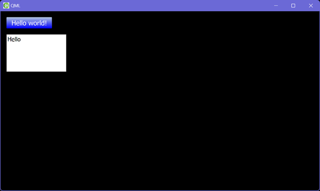

# Offscreen QML for Node.js

This is a part of [Node3D](https://github.com/node-3d) project.

[](https://badge.fury.io/js/qml-raub)
[](https://github.com/node-3d/qml-raub/actions/workflows/eslint.yml)
[](https://github.com/node-3d/qml-raub/actions/workflows/test.yml)
[](https://github.com/node-3d/qml-raub/actions/workflows/cpplint.yml)

```console
npm i -s qml-raub
```

**QML** interoperation addon for **Node.js**.
**QML** is a declarative language that allows user interfaces to be described
in terms of their visual components and how they interact and relate with one another.
See [Qt Documentation](https://doc.qt.io/qt-5/qmlapplications.html)
for additional details on QML features and syntax.



> Note: this **addon uses N-API**, and therefore is ABI-compatible across different
Node.js versions. Addon binaries are precompiled and **there is no compilation**
step during the `npm i` command.


```
const { View } = require('qml-raub');
View.init(HWND, CTX);
```

The first thing to do is to initialize the QML renderer. Pass the native
window handles to the static `init` method. A **shared**
[GL context](https://www.khronos.org/opengl/wiki/OpenGL_Context)
is created based on these handles. QML necessarily has a dedicated GL context
because of the renderer-specific requirements. The produced QML-containing
textures are available to the main application as if its own resources.

If using the [glfw-raub](https://github.com/node-3d/glfw-raub) module for platform
window management, an example obtaining of HWND and CTX would be as follows:

```
// window - is returned by glfw.createWindow(...) call
const HWND = glfw.platformWindow(window);
const CTX = glfw.platformContext(window);
```


### class View

Loads and manages a QML file.

When the file is loaded and whenever the QML scene is resized a new GL
**Texture** (id) is created and reported in an event (type 'reset').
Then the texture can be placed onto any drawable surface.

For example a screen-sized rectangle with this texture would look as if it is
the app's UI, which it already almost is. Also some in-scene quads, e.g. a PC
display in the distant corner of 3d room, can be textured this way.

What is really important, is the dynamic nature of this texture. We can
propagate mouse and keyboard events to the View, and it will react as any
normal QML scene. Also there is a loop-back to propagate back any unused
events. This means a lot for screen-space UI's: we still want the underlying
app to receive mouse and keyboard events as well.

Therefore, using loop-back implies a change from `source -> app` event
flow to `source -> ui -> app`. If mouse click hits a QML button, we don't
want it to also hit an object behind the button. And if some QML input is
focused, we should be able to type any text without hitting random
combinations of app's hotkeys.

```
const view = new View({ width: 800, height: 600, file: 'ui.qml' });
```


Constructor: `View(?opts)`. Param opts (all optional):
* `number ?width 512` - QML view scene width.
* `number ?height 512` - QML view scene height.
* `boolean ?silent false` - ignore QML errors.
* `string ?file ''` - a QML file to be loaded.
* `string ?source ''` - a QML source text to be used instead of a file.

If both `file` and `source` are passed, the `file` is used. If none of them passed
through the opts, the method `load()` can be used later.


Properties:
* `get/set number width|w` - view width.
* `get/set number height|h` - view height.
* `get/set [width, height] wh` - view width and height.
* `get/set {width, height} size` - view width and height.
* `get number textureId` - current GL texture id.


Methods:
* load(opts) - load a new QML scene. The old one will be discarded, if any. A new
texture will be created upon `'load'` event. Param opts:
	* `string ?file` - a QML file to be loaded.
	* `string ?source` - a QML source text to be used instead of a file.
	
	If both `file` and `source` are passed, the `file` is used. If none of them passed,
	an error will be thrown.

* `mousedown(Event e)` - send mousedown event to the QML scene.
* `mouseup(Event e)` - send mouseup event to the QML scene.
* `mousemove(Event e)` - send mousemove event to the QML scene.
* `keydown(Event e)` - send keydown event to the QML scene.
* `keyup(Event e)` - send keyup event to the QML scene.


Events:
* `'destroy'` - emitted when the scene is destroyed.
* `'load'` - emitted when the scene is fully loaded.
* `'reset', textureId` - emitted when the framebuffer has been re-created.
* <ANY_EVENTS> - being an [EventEmitter](https://nodejs.org/api/events.html),
View can emit any events it is told to. Also from QML side, a special global
function `eventEmit(type, data)` is present. Using this function any event can
be generated from QML side.

---

### class Property

Access QML data. Both read and write to a QML object is possible. The object should
have it's `objectName` set, and have a property under a given key. This class can
be used to read and write QML properties from JS.

```
const { View, Property } = require('qml-raub');
...
const view = new View({ width: 800, height: 600, file: 'ui.qml' });
const x1 = new Property({ view, name: 'obj1', key: 'x1' });

x1.value = 10;
```

> Note: The value is transmitted as JSON, so it can't be too special.

Constructor:

* `Property({ view, name, key, ?value })`
	* `View view` - a view, where the property resides.
	* `string name` - the name of an object within QML scene.
	* `string key` - property key.
	* `any ?value undefined` - initial value to be set.

If `opts.value` is present, it will be sent to QML side as soon as possible.
In case the view is not yet loaded, the value will be sent upon `'load'` event.

Properties:

* `get string opts` - holds `view, name, key` (but it's a different object) for later use.
* `get/set any value` - current property value.
	
	> NOTE: can't fetch a property while the View is still loading.
	Only try to get the value after the View has emitted the `'load'` event.


---

### class Method

Call QML method. The QML object should have it's `objectName` set,
and have a method (function) under a given key. This class can
be used to store the credentials of a QML method for multiple calls.

```
const { View, Method } = require('qml-raub');
...
const view = new View({ width: 800, height: 600, file: 'ui.qml' });
const f1 = new Method({ view, name: 'obj1', key: 'f1' });

const y = f1(a, b, c);
```

Instances of this class are actually functions on their own. Up to 10 arguments
can be used for the call. Functions may immediately return a value.

> NOTE: can't fetch a return value while the View is still loading.
Such a call will always return `null`, however the function will still
be called right after the View emits the `'load'` event.


Constructor:

* `Method({ view, name, key })`
	* `View view` - a view, where the property resides.
	* `string name` - the name of an object within QML scene.
	* `string key` - property key.


Properties:

* `get string opts` - holds `view, name, key` (but it's a different object) for later use.
