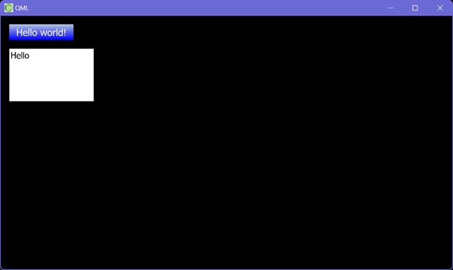

# Offscreen QML for Node.js

This is a part of [Node3D](https://github.com/node-3d) project.

[](https://badge.fury.io/js/@node-3d/qml)
[](https://github.com/node-3d/qml/actions/workflows/lint.yml)
[](https://github.com/node-3d/qml/actions/workflows/test.yml)
[](https://github.com/node-3d/qml/actions/workflows/cpplint.yml)

```console
npm install @node-3d/qml
```

**QML (Qt 6.8.0)** interoperation addon for **Node.js**.
See [Qt Documentation](https://doc.qt.io/qt-6/qmlapplications.html)
for QML features and syntax.



> Note: this **addon uses N-API**, and therefore is ABI-compatible across different
Node.js versions. Addon binaries are precompiled and **there is no compilation**
step during the `npm install` command.

```js
import { View } from '@node-3d/qml';

View.init(process.cwd(), hwnd, ctx, device);

const ui = new View({ width, height, file: 'gui.qml' });
```

The QML engine must be initialized first. Then, new View instances can be created.

* See [example](/examples/main.ts) for a complete setup.

## API

### `View`

`View` loads and manages one QML scene rendered into an OpenGL texture.
Call `View.init(cwd, wnd, ctx, device?)` once before constructing views:

* `cwd` - base path for relative QML files and the default `plugins` directory.
* `wnd` - native platform window handle.
* `ctx` - shared OpenGL context handle.
* `device` - optional platform display/device handle.

Constructor options:

* `width`, `height` - texture size, defaulting to `512`.
* `file` - QML file to load immediately.
* `source` - QML source string to load immediately.
* `silent` - suppress QML runtime error logging.

Static helpers:

* `View.libs(path)` - add a QML import directory.
* `View.plugins(path)` - add a Qt plugin directory.
* `View.style(name, fallback?)` - set the Qt Quick style.
* `View.update()` - process pending QML events and async work.

Instance members:

* `isLoaded`, `width`, `height`, `w`, `h`, `wh`, `size`, `textureId`
* `load({ file } | { source })`
* `destroy()`
* `mousedown`, `mouseup`, `mousemove`, `wheel`, `keydown`, `keyup`
* `get(name, key)`, `set(name, key, value)`, `invoke(name, key, args)`

Important events:

* `destroy` - QML scene was destroyed.
* `load` - QML scene finished loading.
* `reset`, with `textureId` - render texture was created or replaced.
* `error` - QML load/runtime error.
* Any custom event emitted by QML through `eventEmit(type, data)`.

When the file is loaded, and whenever the QML scene is resized, a new GL texture ID is
reported through `reset`. Use that texture on a full-screen quad for UI overlays, or on
in-scene objects such as screens and panels.

QML views can process input events. Mouse and keyboard events can be sent to a view.
Unhandled (unused) events are re-emitted by the view.
Changing the event flow from `window -> app` to `window -> ui -> app` allows blocking
the handled events. For example, when a QML button is pressed, a 3D scene
behind the button won't receive any mouse event. Or when a QML input is
focused, the app's hotkeys won't be triggered by typing text.

---

## Property

Helper class to access QML data. Automates reading and writing QML objects. A QML object should
have `objectName` and the target property. The value must be serializable.

```js
const x1 = new Property({ view, name: 'obj1', key: 'x1' });
x1.value = 10;
```

If an initial `value` is provided before the view has loaded, it is written after the
view emits `load`. Reads before load return `null`.

---

## Method

Helper class to call a QML method. A QML object should have `objectName`
and the target method.

```js
const f1 = new Method({ view, name: 'obj1', key: 'f1' });
const y = f1(a, b, c);
```

Instances of this class are functions with an attached `opts` object. Arguments and return
values are serialized through JSON, so keep them data-oriented.
